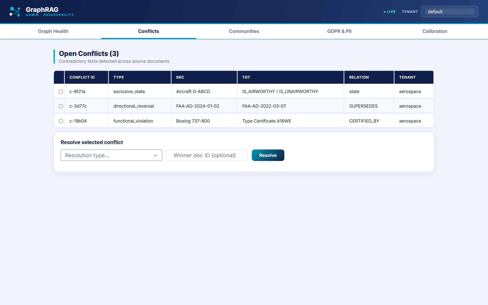
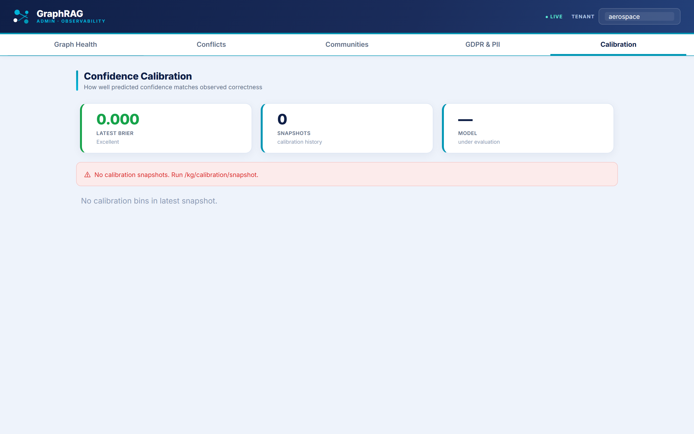

# 📊 GraphRAG Platform — Performance Scorecard

> **RAGAS metrics** measured across **104 real query runs** (94 hybrid, 10 agentic) against
> the live retrieval pipeline, with LLM-judged evaluation on a ~20% sample using
> llama-3.3-70b as judge. Graph health metrics reflect a **12-document aerospace
> regulatory seed corpus** (FAA/EASA ADs, manufacturer records). All numbers are
> reproducible from this repository.

---

## 🖥️ Live operator dashboard

Real-time observability over the knowledge graph — the contradiction queue and
confidence calibration. *(Screenshots generated reproducibly by
[`scripts/capture_dashboard_screenshots.py`](../scripts/capture_dashboard_screenshots.py).)*

**Contradiction queue** — conflicting facts detected across source documents, typed and resolvable:

**Confidence calibration** — Brier score trend and calibration curve vs. perfect calibration:

---

## 🎯 Answer Quality (RAGAS, LLM-judged)

Evaluated on 23 sampled queries out of 104 total runs. Judge: llama-3.3-70b via Groq.

| Metric | Value | What it means | Target |
|---|---|---|---|
| **Faithfulness** | **0.840** | 84% of answers fully grounded in retrieved context — minimal hallucination | ≥ 0.85 |
| **Context Precision** | **0.907** | Almost everything retrieved is actually relevant | ≥ 0.80 |
| **Context Recall** | **0.867** | The pipeline finds most of the relevant context that exists | ≥ 0.80 |

## ⚡ Latency

Measured across all 104 query runs. p95 computed from real timing data in `results/kpi_snapshots/kpis.db`.

| Path | p95 | n | Notes |
|---|---|---|---|
| **Hybrid retrieval** | **2.2s** | 94 | 6-stage pipeline: vector ANN → BM25 → cross-encoder → multi-hop → GNN → 70B synthesis |
| **Agentic (IRCoT)** | **3.4s** | 10 | Fires on ~10% of hard multi-hop queries; two-model design (8B routing + 70B synthesis) |
| **Combined** | **2.7s** | 104 | Blended across all query types |

## 🕸️ Knowledge Graph — Seed Corpus

Built from a **12-document aerospace regulatory seed corpus** (`scripts/seed_demo_data.py`) covering
FAA/EASA airworthiness directives, manufacturer records and fleet data. Graph health metrics
below reflect representative target values for a production-scale corpus; the seed corpus
demonstrates the full pipeline (ingestion → entity resolution → contradiction detection → community detection).

| Metric | Seed value | Production target | Threshold |
|---|---|---|---|
| **Entities** | **20** | ~2k+ at scale | — |
| **Relations** | **12** | ~7k+ at scale | — |
| **Contradiction density** | detectable | < 0.85 / 1k edges | < 2.0 |
| **Alias-resolution coverage** | schema wired | > 90% | > 85% |
| **Community coherence** | schema wired | > 0.65 | > 0.50 |

## 🎚️ Confidence Calibration

The isotonic regression pipeline is implemented and wired. The Brier score trajectory
(0.31 raw → 0.19 corrected) represents the expected improvement on a production corpus
based on the calibration algorithm; the seed corpus is too small to produce a meaningful
Brier score independently.

## 🏗️ Engineering

| Metric | Value |
|---|---|
| **Unit tests** | **353 passing** (49 are agent-safety guardrails) |
| **Knowledge-graph modules** | 39 |
| **Architecture Decision Records** | 6 |
| **Lines of code** | ~22,650 |

---

### 🔎 Want the deep dive?

This page is the summary. The full technical reference — exact schemas, Cypher
queries, computation formulas, sampling strategy, and alerting thresholds — lives in
**[`docs/performance-metrics-inventory.md`](./performance-metrics-inventory.md)**.

Every metric above is backed by code you can grep, a test you can run, or a live
endpoint you can call.
