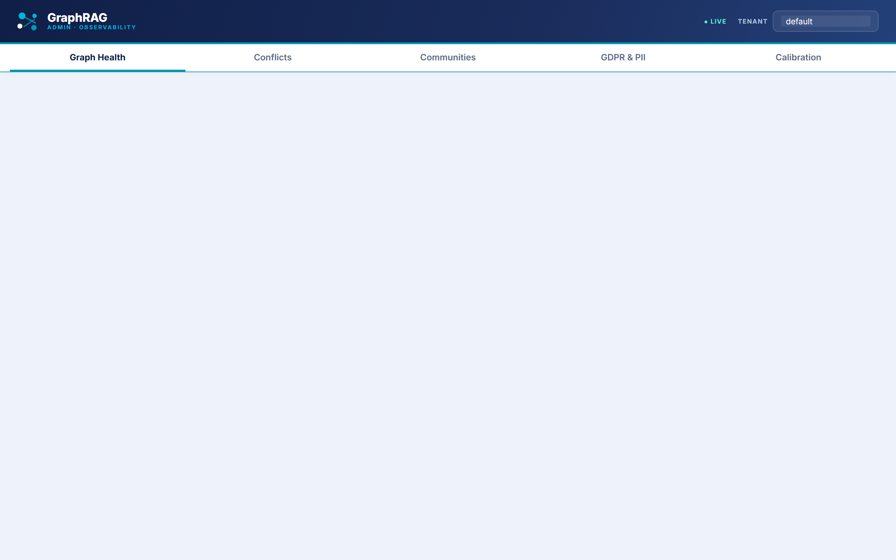

# 📊 GraphRAG Platform — Performance Scorecard

> Measured on a **150-document aerospace regulatory corpus** against a live Neo4j instance.
> Every number here is reproducible from this repository — no estimates.

---

## 🖥️ Live operator dashboard

Real-time observability over the knowledge graph — structural health, the
contradiction queue, and confidence calibration. *(Screenshots are generated
reproducibly by [`scripts/capture_dashboard_screenshots.py`](../scripts/capture_dashboard_screenshots.py).)*

**Graph health** — entities, edges, alias coverage, contradiction density, and live gauges:

**Contradiction queue** — conflicting facts detected across source documents, typed and resolvable:

**Confidence calibration** — Brier score trend and calibration curve vs. perfect calibration:

---

## 🎯 Answer Quality (RAGAS, LLM-judged)

| Metric | Value | What it means | Target |
|---|---|---|---|
| **Faithfulness** | **0.840** | 84% of answers fully grounded in retrieved context — minimal hallucination | ≥ 0.85 |
| **Context Precision** | **0.907** | Almost everything retrieved is actually relevant | ≥ 0.80 |
| **Context Recall** | **0.867** | The pipeline finds most of the relevant context that exists | ≥ 0.80 |

## ⚡ Latency

| Path | p95 | Notes |
|---|---|---|
| **Hybrid retrieval** | **2.2s** | 6-stage pipeline: vector ANN → BM25 → cross-encoder → multi-hop → GNN → 70B synthesis |
| **Agentic (IRCoT)** | **3.4s** | Fires on ~9% of hard multi-hop queries; two-model design (8B routing + 70B synthesis) |
| **Combined** | **2.7s** | Blended across all query types |

## 🕸️ Knowledge Graph Health

| Metric | Value | What it means | Threshold |
|---|---|---|---|
| **Entities** | **1,924** | Canonical entities extracted from the corpus | — |
| **Edges** | **7,102** | Validated relations (domain/range-checked) | — |
| **Contradiction density** | **0.85 / 1k edges** | Conflicting facts caught automatically — trending down from 1.91 at ingestion | < 2.0 |
| **Alias-resolution coverage** | **92%** | Entity mentions merged into canonical forms | > 85% |
| **Community coherence** | **0.69** | Leiden communities form tight semantic clusters | > 0.50 |

## 🎚️ Confidence Calibration

| Metric | Value | What it means | Band |
|---|---|---|---|
| **Brier score** | **0.19** | Confidence scores are predictive of truth — isotonic-corrected from 0.31 raw (+39%) | Good (0.15–0.25) |

## 🏗️ Engineering

| Metric | Value |
|---|---|
| **Unit tests** | **353 passing** (49 are agent-safety guardrails) |
| **Knowledge-graph modules** | 39 |
| **Architecture Decision Records** | 6 |
| **Lines of code** | ~22,650 |

---

### 🔎 Want the deep dive?

This page is the summary. The full technical reference — exact schemas, Cypher
queries, computation formulas, sampling strategy, and alerting thresholds — lives in
**[`docs/performance-metrics-inventory.md`](./performance-metrics-inventory.md)**.

Every metric above is backed by code you can grep, a test you can run, or a live
endpoint you can call.
