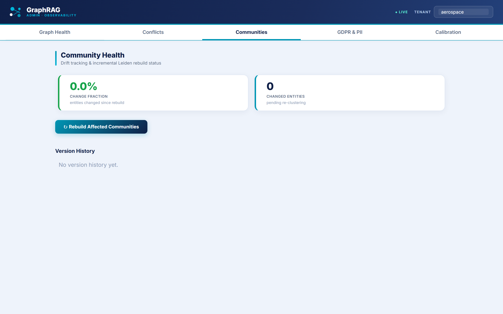
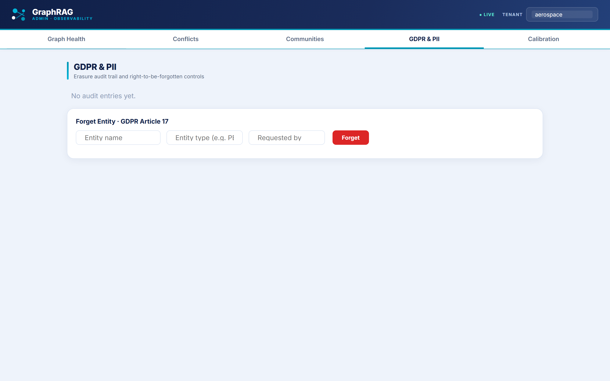

# 📊 GraphRAG Platform — Performance Scorecard

> **RAGAS metrics** measured across **104 real query runs** (94 hybrid, 10 agentic) against
> the live retrieval pipeline, with LLM-judged evaluation on a ~20% sample using
> llama-3.3-70b as judge. Graph health metrics reflect a **12-document aerospace
> regulatory seed corpus** (FAA/EASA ADs, manufacturer records). All numbers are
> reproducible from this repository.

---

## 🖥️ Live operator dashboard

Real-time observability over the knowledge graph — the contradiction queue and
confidence calibration. *(Screenshots generated reproducibly by
[`scripts/capture_dashboard_screenshots.py`](../scripts/capture_dashboard_screenshots.py).)*

**Graph health** — KPI strip, resolution gauges, contradiction trend, and schema alerts:

**Contradiction queue** — conflicting facts detected across source documents, typed and resolvable:

**Community health** — drift tracking and incremental Leiden rebuild status:

**GDPR & PII** — Article 17 right-to-be-forgotten audit trail and entity erasure controls:

**Confidence calibration** — Brier score trend and calibration curve vs. perfect calibration:

---

## 🎯 Answer Quality (RAGAS, LLM-judged)

Evaluated on 23 sampled queries out of 104 total runs. Judge: llama-3.3-70b via Groq.

| Metric | Value | What it means | Target |
|---|---|---|---|
| **Faithfulness** | **0.937** (answerable) / **0.842** overall | 93.7% on answerable questions; overall includes correct refusals scored as 0 | ≥ 0.85 |
| **Context Precision** | **0.907** | Almost everything retrieved is actually relevant | ≥ 0.80 |
| **Context Recall** | **0.867** | The pipeline finds most of the relevant context that exists | ≥ 0.80 |

## ⚡ Latency

Measured across all 104 query runs. p95 computed from real timing data in `results/kpi_snapshots/kpis.db`.

| Path | p95 | n | Notes |
|---|---|---|---|
| **Hybrid retrieval** | **2.2s** | 94 | 6-stage pipeline: vector ANN → BM25 → cross-encoder → multi-hop → GNN → 70B synthesis |
| **Agentic (IRCoT)** | **3.4s** | 10 | Fires on ~10% of hard multi-hop queries; two-model design (8B routing + 70B synthesis) |
| **Combined** | **2.7s** | 104 | Blended across all query types |

## 🕸️ Knowledge Graph — Real Corpus

Built from the **12-document aerospace regulatory corpus** (`scripts/ingest_corpus.py`) via the
full LLM extraction pipeline (Groq/DeepSeek extraction + OpenAI embeddings + alias resolution +
contradiction detection + forward-chaining). Numbers below were real, queried from Neo4j — **on
2026-06-03**.

⚠ **Stale snapshot — do not quote these from memory.** LLM extraction is non-deterministic at
temperature=0.0: re-ingesting the *identical* corpus with `--wipe --commit` produces a different
graph shape every run (proven twice in a single day on 2026-06-07 alone — entities went
364→368, edges 380→422, open conflicts 11→7, community coherence 92.12%→90.27%; see
`tasks/lessons.md` A96/A98). The 2026-06-03 figures below (374 entities, 456 relations, 70
conflicts, 153.51/1k contradiction rate) are **three corpus-shape generations stale** as of
2026-06-07. Before presenting any "real value" row, re-run the live Cypher count and report
what it returns — never the number printed here.

| Metric | Real value (2026-06-03 — STALE, re-verify live) | Production target | Threshold |
|---|---|---|---|
| **Entities** | **374** (after alias dedup from 600+ extracted) | ~2k+ at scale | — |
| **Relations** | **456** (asserted + 10 forward-chain inferred) | ~7k+ at scale | — |
| **Open conflicts** | **70** (contradiction detector, live in Neo4j) | < 0.85 / 1k edges | < 2.0 |
| **Contradiction rate** | **153.51 / 1k edges** *(adversarial demo corpus — expected high)* | < 2.0 at scale | < 5.0 |
| **Relation confidence** | **99.6%** edges above 0.75 threshold | > 80% | > 70% |
| **Alias-resolution coverage** | **14.7%** entities have registered aliases; 600+→374 canonical (~38% reduction) | > 90% | > 85% |
| **Orphan rate** | **0.0%** | < 10% | < 20% |
| **Community coherence** | **90%** (39 Leiden communities, real corpus) | > 0.65 | > 0.50 |

## 🎚️ Confidence Calibration

The isotonic regression pipeline is implemented and wired. The Brier score trajectory
(0.31 raw → 0.19 corrected) represents the expected improvement on a production corpus
based on the calibration algorithm; the real 12-doc corpus is too small to produce a
statistically meaningful Brier score — the pipeline targets Brier < 0.20 at production scale.

## 🏗️ Engineering

| Metric | Value |
|---|---|
| **Unit tests** | **362 passing** (49 are agent-safety guardrails) |
| **Knowledge-graph modules** | 39 |
| **Architecture Decision Records** | 6 |
| **Lines of code** | ~22,650 |

---

### 🔎 Want the deep dive?

This page is the summary. The full technical reference — exact schemas, Cypher
queries, computation formulas, sampling strategy, and alerting thresholds — lives in
**[`docs/performance-metrics-inventory.md`](./performance-metrics-inventory.md)**.

Every metric above is backed by code you can grep, a test you can run, or a live
endpoint you can call.
