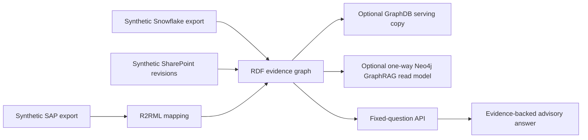

# Energy Asset & Maintenance Intelligence

This POC answers an operational review question across synthetic SAP-shaped
work orders, Snowflake-shaped measurements, and SharePoint-shaped technical
guidance. It returns an advisory assessment with its source fields, document
revision, timestamps, and access scope.

The POC covers executable R2RML/RML RDF materialisation, canonical RDF/OWL and
SHACL contracts, version-controlled SPARQL evidence, temporal bulletin
supersession, no-evidence abstention, tenant-scoped API access, portable RDF
export, and an optional one-way Neo4j GraphRAG read model.

The business demonstration follows one story: WT-01 is flagged because its
96 C gearbox observation exceeds the current bulletin’s 85 C threshold while
work order WO-9001 is open. A historical query shows that revision R1 was
authoritative before 2026-06-01 and used a 90 C threshold. Assets without
enough evidence return an incomplete assessment rather than a recommendation.

Run `python scripts/run_energy_demo_e2e.py --output
artifacts/energy-demo-e2e-report.json` to prove the local scenario end to end.
All source data is synthetic. The project does not claim live SAP, Snowflake,
or SharePoint integration, enterprise-scale performance, or client-environment
operations; those are tracked in the production-readiness preflight.
