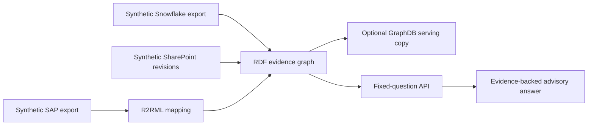

# Energy Asset & Maintenance Intelligence

This POC answers an operational review question across synthetic SAP-shaped
work orders, Snowflake-shaped measurements, and SharePoint-shaped technical
guidance. It returns an advisory assessment with its source fields, document
revision, timestamps, and access scope.

The POC covers RDF modelling, SPARQL query artifacts, R2RML validation,
SHACL constraints, GraphRAG-style evidence bundles, temporal bulletin
supersession, tenant-scoped API access, and a real RDF-store deployment path.

The business demonstration follows one story: WT-01 is flagged because its
96 C gearbox observation exceeds the current bulletin’s 85 C threshold while
work order WO-9001 is open. A historical query shows that revision R1 was
authoritative before 2026-06-01 and used a 90 C threshold. Assets without
enough evidence return an incomplete assessment rather than a recommendation.

All source data is synthetic. The project does not claim live SAP, Snowflake,
or SharePoint integration, enterprise-scale performance, or verified GraphDB
operation until a running service is available.
