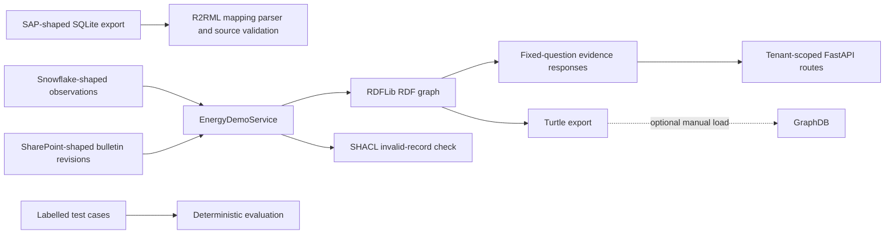

# Energy Asset & Maintenance Intelligence — implementation walkthrough

Audience: hiring manager and technical client for the Knowledge Graph Engineer role.

Format: six-minute live implementation walkthrough or recorded terminal demo.

The goal is to show the code path that exists in this repository. All data is synthetic. Keep a visible caption throughout: **Synthetic data · Advisory POC**.

## The implementation flow



The R2RML branch and the RDF response branch share the same synthetic domain but are separate code paths today. State that clearly: the R2RML script validates the relational source contract; `EnergyDemoService` currently builds its in-memory RDF graph from deterministic fixtures.

## Before recording

Open these files in tabs:

1. `scripts/create_energy_demo_sqlite.py`
2. `ontology/mappings/energy-assets.r2rml.ttl`
3. `scripts/ingest_r2rml.py`
4. `graphrag/domains/energy/demo.py`
5. `ontology/shapes/energy-asset-intelligence.shapes.ttl`
6. `api/routes/energy_demo.py`
7. `evals/energy_demo/questions.json`

Use a terminal in the repository root. Run each command below live. The expected outputs are described so the presenter knows what to highlight.

## Scene 1 — Start with the data contract

**Time:** 0:00–0:45

**Screen:** `scripts/create_energy_demo_sqlite.py`.

**Voiceover:**

> I start with a reproducible SAP-shaped source. This script creates a SQLite database containing ten wind-turbine assets and three work orders. It deliberately looks like an operational export: each work order has an identifier, an asset identifier, and a status. The database is synthetic, so the workflow can be demonstrated safely and rerun without external access.

**Run:**

```powershell
python scripts/create_energy_demo_sqlite.py
```

**Highlight:** `Created synthetic SAP-shaped SQLite export: artifacts/energy-demo-sap.sqlite`.

## Scene 2 — Use a declarative R2RML mapping

**Time:** 0:45–1:35

**Screen:** `ontology/mappings/energy-assets.r2rml.ttl`, then `scripts/ingest_r2rml.py`.

**Voiceover:**

> The mapping describes how the relational tables become graph entities. The asset table maps to turbine entities, and the work-order table maps to work-order entities. The ingestion command parses the TTL mapping through the platform’s R2RML parser, reads the SQLite source, and validates the mapping against the available rows before it writes anything.

**Run:**

```powershell
python scripts/ingest_r2rml.py --mapping ontology/mappings/energy-assets.r2rml.ttl --sqlite artifacts/energy-demo-sap.sqlite --tenant energy-demo --source-id synthetic-sap --validate-only
```

**Highlight:** `ingest_r2rml.validated`, the `energy-demo` tenant, and the entity-row count.

**Voiceover continuation:**

> I use `--validate-only` in the presentation so this step is safe and repeatable. Removing that flag calls the existing relational graph ingestor, which writes through the platform graph writer. This proof of concept does not yet feed that ingest output into the energy answer service, so I treat this as a validated integration boundary rather than an end-to-end source connection.

## Scene 3 — Build the RDF evidence graph

**Time:** 1:35–2:30

**Screen:** `graphrag/domains/energy/demo.py`, focusing on `_build_graph`, `_add_observation`, and `_add_bulletin`.

**Voiceover:**

> The demonstration service builds an RDFLib graph from the synthetic domain fixtures. It creates assets and gearbox components, adds Snowflake-shaped temperature and vibration observations, attaches SAP-shaped work orders, and adds versioned SharePoint-shaped manufacturer bulletins. The RDF model uses explicit types and predicates, plus provenance references for every source category.

**Run:**

```powershell
python scripts/run_energy_demo.py --export-turtle artifacts/energy-demo.ttl
```

**Screen:** Open `artifacts/energy-demo.ttl`.

**Voiceover continuation:**

> This exports the same in-memory graph as Turtle. Here, WT-01 is connected to its gearbox; an observation records 96 degrees Celsius; the open work order is WO-9001; and bulletin MFG-GBX-17-R2 gives the current 85-degree review threshold.

## Scene 4 — Ask the implemented business questions

**Time:** 2:30–3:25

**Screen:** Terminal output from the preceding command. Move through the five question headings and their JSON responses.

**Voiceover:**

> The service exposes five fixed operational questions. The maintenance-review response identifies WT-01, shows the 96-degree observation, the open work order, and the applicable bulletin. Each response includes its source identifier, source type, source field, timestamps, access scope, mapping version, and query version.

**Highlight:** the `maintenance_review` response, then `insufficient_evidence`.

**Voiceover continuation:**

> The final question is as important as the alert: WT-04 through WT-10 return insufficient evidence because the required synthetic observations or work-order state are missing. The service does not turn missing data into a recommendation.

**Accurate implementation note:** The question responses are deterministic service logic over the RDF domain fixtures. The version-controlled SPARQL query is an engineering artifact for the next query-backed stage; it is not executed by these responses yet.

## Scene 5 — Show version-aware guidance

**Time:** 3:25–4:05

**Screen:** `graphrag/domains/energy/demo.py` at `_add_bulletin` and `answer`, then terminal output from the command below.

**Voiceover:**

> Technical guidance changes, so the model records document revisions and their validity dates. R2 supersedes R1 on 2026-06-01 and lowers the synthetic gearbox threshold from 90 to 85 degrees. The service selects R1 when a May date is supplied.

**Run:**

```powershell
python scripts/run_energy_demo.py --as-of 2026-05-01T00:00:00Z
```

**Highlight:** `historical_state`, `MFG-GBX-17-R1`, and `90°C`.

**Voiceover continuation:**

> This implements bulletin selection by effective date. Full point-in-time reconstruction of every observation and work order remains a next step, because the evidence payload is not yet filtered to the requested date.

## Scene 6 — Validate graph quality with SHACL

**Time:** 4:05–4:40

**Screen:** `ontology/shapes/energy-asset-intelligence.shapes.ttl`, then terminal output from the earlier `run_energy_demo` command.

**Voiceover:**

> The POC uses SHACL to validate a deliberately invalid observation. The candidate has an asset and timestamp but lacks the required unit and value. The service runs `pyshacl`, reports `conforms: false`, and returns the validation messages. This gives a clear example of semantic data quality rules that can be enforced before a record is trusted by a retrieval workflow.

**Highlight:** `Invalid-batch validation`, `conforms: false`, and the violation text.

## Scene 7 — Expose the service safely

**Time:** 4:40–5:20

**Screen:** `api/main.py` at the `/energy-demo` router registration, then `api/routes/energy_demo.py`.

**Voiceover:**

> The FastAPI router places this demonstration under `/energy-demo`. It requires the platform’s `read` scope and checks that the tenant is `energy-demo`. The routes return the allowed questions, an answer by fixed question ID, the RDF export, and the validation result. A request from any other tenant receives no evidence.

**Highlight:** `Depends(require_scope("read"))`, `get_tenant`, and the `tenant != "energy-demo"` checks.

**Voiceover continuation:**

> The design deliberately avoids arbitrary client-supplied SPARQL. It gives the application a small, reviewable API surface while the query layer is still being developed.

## Scene 8 — Verify the scenario stays reproducible

**Time:** 5:20–5:50

**Screen:** `evals/energy_demo/questions.json`, then run the evaluator.

**Run:**

```powershell
python scripts/evaluate_energy_demo.py
```

**Voiceover:**

> The scenario has five labelled expectations: the current maintenance result, affected work orders, the bulletin revision, historical bulletin selection, and insufficient-evidence status. This evaluator runs all five deterministic cases and reports the result. Unit tests also cover RDF serialization, tenant isolation, invalid-record validation, and the mapping contract.

**Highlight:** `passed: 5` and `total: 5` when the run succeeds.

## Closing words

**Time:** 5:50–6:15

**Screen:** The workflow diagram or the demo brief.

**Voiceover:**

> This repository already demonstrates the engineering building blocks: source contracts, declarative mapping validation, RDF modelling, document revision handling, SHACL validation, evidence-shaped responses, tenant-aware API routes, and reproducible checks. The next implementation milestone is clear: execute version-controlled SPARQL against the RDF graph or a verified RDF store, use those results to build the responses, and then connect approved SAP, Snowflake, and SharePoint sources end to end.

## Technical questions to invite

- “Which of your operational questions should become the first query-backed use case?”
- “Which source would you connect first: work orders, telemetry, or technical guidance?”
- “What access-control model and historical-audit requirement would the client need?”

## Claims to keep precise

| Implemented and demonstrable | Next implementation milestone |
| --- | --- |
| Synthetic SQLite export and R2RML mapping validation | Live SAP, Snowflake, or SharePoint connectors |
| RDFLib graph built from synthetic fixtures | Graph populated directly from R2RML ingest output |
| Fixed deterministic evidence responses | SPARQL-executed, query-backed responses |
| Bulletin selection by effective date | Complete point-in-time filtering of all evidence |
| SHACL validation of a test candidate | Validation wired into every ingest path |
| Tenant checks in the API route/service | End-to-end authenticated API rehearsal and authorization tests |
| Optional GraphDB compose configuration | Verified GraphDB repository load and query integration |
