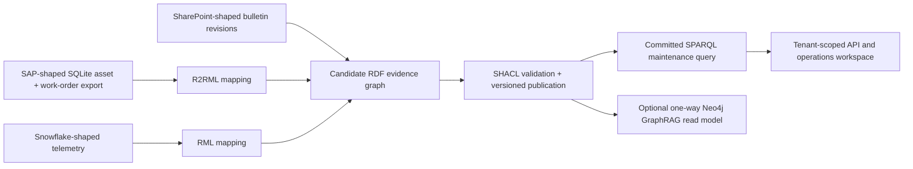

# Energy Asset & Maintenance Intelligence — E2E presentation script

Audience: an Energy business stakeholder and a technical Knowledge Graph
Engineering interviewer. Keep the on-screen caption: **Synthetic data ·
Advisory POC · No equipment control**.

The scenario is real and repeatable from this repository:

```powershell
python scripts/run_energy_demo_e2e.py --output artifacts/energy-demo-e2e-report.json
```

It creates the source fixture, maps records into RDF, validates and publishes
the graph, executes the committed SPARQL maintenance query, proves historical
reasoning and abstention, checks tenant isolation, exports Turtle, and builds
the governed Neo4j read-model batch. `--live-neo4j` additionally writes that
read model to a configured Neo4j instance.



## Scene 1 — Business outcome first (0:00–0:40)

Open the Energy workspace or show the report’s `maintenance_review` section.

> WT-01 needs advisory review. Its gearbox temperature is 96°C, above the
> current 85°C manufacturer threshold, and work order WO-9001 is still open.
> The application shows the evidence rather than a free-floating AI claim.

Highlight the three source categories: SAP-shaped work order, Snowflake-shaped
telemetry, and SharePoint-shaped technical guidance.

## Scene 2 — Source-to-RDF materialisation (0:40–1:30)

Open `scripts/create_energy_demo_sqlite.py`, then
`ontology/mappings/energy-assets.r2rml.ttl`.

> The source is a deterministic SAP-shaped SQLite export. The checked-in R2RML
> mapping creates stable RDF IRIs and types every turbine as both an Asset and
> a WindTurbine. RML maps the Snowflake-shaped telemetry. The graph is not
> hand-written Turtle; these source mappings execute on every scenario run.

Highlight `artifacts/energy-demo-e2e.ttl` and its 135 triples after the run.

## Scene 3 — Semantic safety gate (1:30–2:10)

Open `ontology/models/energy-asset-intelligence.yaml` and the generated OWL,
SHACL and Neo4j constraints.

> The domain meaning is authored once, then compiled for RDF and property-graph
> targets. Before any graph becomes visible to the advisory, SHACL validates it
> and publishes only the conformant version. The scenario also injects an
> incomplete observation and proves that it is rejected rather than used.

Highlight `published_triples: 135`, `quarantined_records: 0`, and the invalid
probe’s `conforms: false` result in the JSON report.

## Scene 4 — Explainable SPARQL advisory (2:10–3:00)

Open `evals/energy_demo/sparql/maintenance_review.rq` beside the report.

> The recommendation is based on a version-controlled SPARQL query. It joins
> the affected turbine, current telemetry, the authoritative bulletin and its
> open work order. The resulting answer includes the query version, mapping
> version, source identifiers, timestamps and values.

Point to WT-01, 96°C, MFG-GBX-17-R2, 85°C and WO-9001.

## Scene 5 — Temporal and no-evidence behavior (3:00–3:40)

Show `historical_state` and `insufficient_evidence` in the report.

> The model is revision-aware: before 1 June 2026, R1 was authoritative and
> the threshold was 90°C; afterwards R2 lowered it to 85°C. Equally important,
> WT-04 through WT-10 return insufficient evidence. Missing telemetry or work
> context is never converted into a maintenance conclusion.

## Scene 6 — Tenant boundary and operational UI (3:40–4:15)

Show `wrong_tenant` in the report and then the Energy workspace.

> Tenant identity comes from signed authentication, not a request parameter.
> A different tenant receives no Energy evidence. The workspace is designed for
> operations users: answer first, then expandable RDF, SPARQL and validation
> detail for technical review.

## Scene 7 — Neo4j GraphRAG read model (4:15–5:00)

Show the `neo4j_projection` report section and
`graphrag/domains/energy/lpg_projection.py`.

> RDF remains the source of truth for semantic governance and SPARQL. The
> optional Neo4j projection makes the same published evidence efficient for
> operational traversal and GraphRAG—for example turbine → gearbox →
> observation → work order → bulletin. It preserves RDF identity, tenant and
> provenance, rejects lossy RDF constructs, and is one-way: Neo4j can be
> rebuilt from RDF but cannot overwrite it.

The default scenario proves the exact Neo4j batch contract without database
writes. Run `python scripts/run_energy_demo_e2e.py --live-neo4j` only when a
configured local Neo4j instance should receive the projection.

## Closing (5:00–5:25)

> This POC demonstrates a governed Energy knowledge graph, not a slideware
> integration claim: deterministic source mappings, RDF semantics, SHACL data
> quality, SPARQL evidence, temporal guidance, tenant isolation and an optional
> GraphRAG read model. The client-specific next step is connecting approved SAP,
> Snowflake and SharePoint contracts and collecting the production evidence in
> the preflight checklist.

Useful follow-up questions:

- Which maintenance decision should become the first production competency question?
- Which source contract should be onboarded first: assets/work orders, telemetry, or technical guidance?
- What approval, audit and tenant-access controls does the operating model require?
